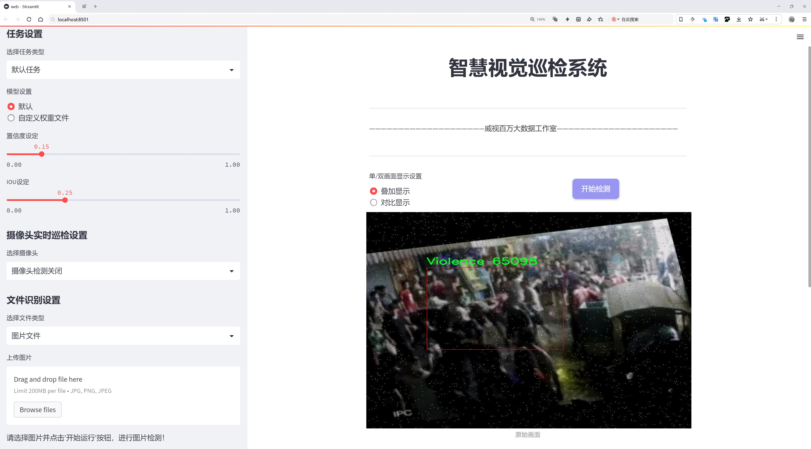
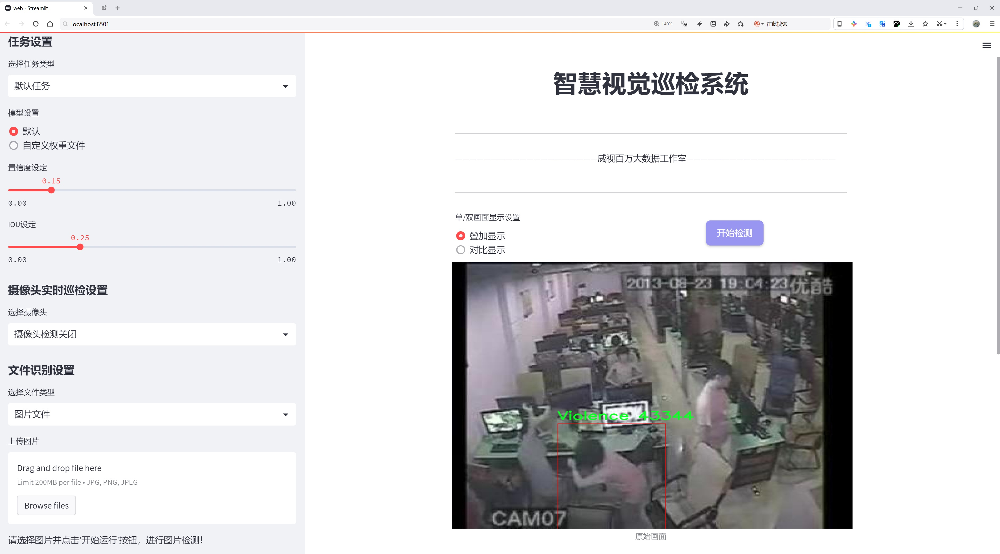
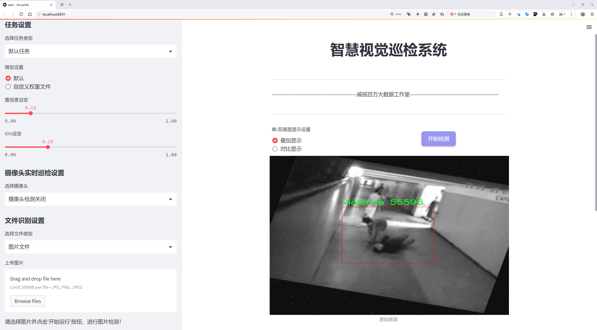
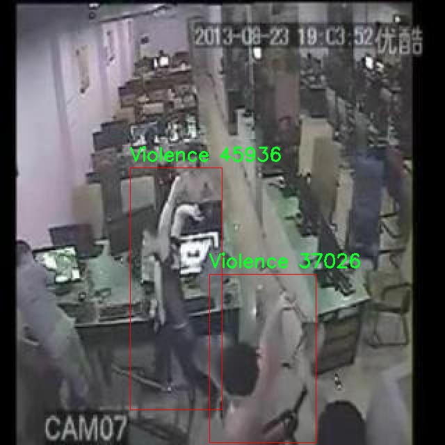
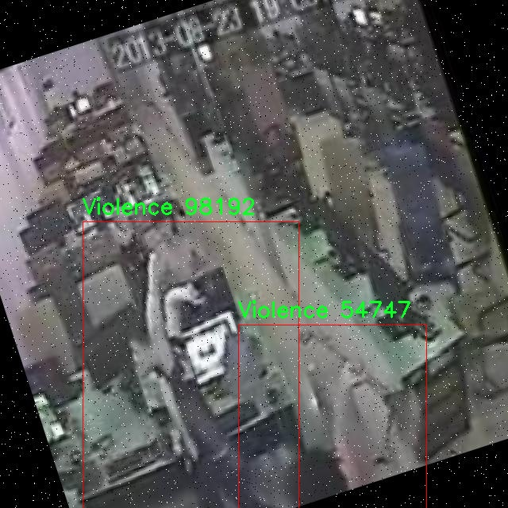
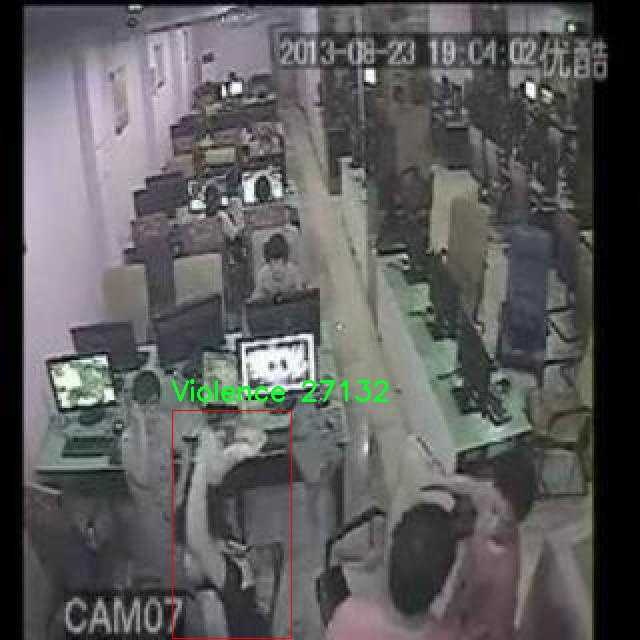
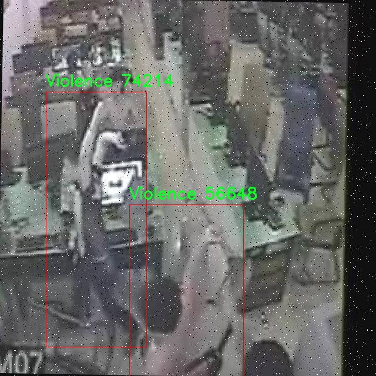

# 暴力与正常人体行为检测检测系统源码分享
 # [一条龙教学YOLOV8标注好的数据集一键训练_70+全套改进创新点发刊_Web前端展示]

### 1.研究背景与意义

项目参考[AAAI Association for the Advancement of Artificial Intelligence](https://gitee.com/qunmasj/projects)

项目来源[AACV Association for the Advancement of Computer Vision](https://kdocs.cn/l/cszuIiCKVNis)

研究背景与意义

随着社会的快速发展，公共安全问题日益凸显，暴力行为的频发不仅对社会治安造成了严重影响，也对人们的心理健康和生活质量产生了负面影响。因此，如何有效地监测和识别暴力行为，成为了社会科学、计算机科学及人工智能领域亟待解决的重要课题。传统的暴力行为检测方法多依赖于人工观察和经验判断，存在着主观性强、效率低下等缺陷。近年来，随着深度学习技术的迅猛发展，基于计算机视觉的行为识别系统逐渐成为研究热点，尤其是基于YOLO（You Only Look Once）系列模型的目标检测技术，因其高效性和实时性，广泛应用于各种视觉任务中。

本研究旨在基于改进的YOLOv8模型，构建一个针对暴力与正常人体行为的检测系统。该系统将利用一个包含2756张图像的数据集，涵盖暴力（Violence）与非暴力（NonViolence）两类行为。通过对该数据集的深入分析与处理，研究将探讨如何提高模型在复杂场景下的识别准确率和鲁棒性。数据集的构建不仅为模型训练提供了丰富的样本，也为后续的模型评估和优化奠定了基础。具体而言，研究将关注数据集中的样本多样性和标注准确性，以确保模型能够在真实场景中有效识别不同类型的行为。

在技术层面，YOLOv8作为YOLO系列的最新版本，具备更强的特征提取能力和更快的推理速度。通过对YOLOv8模型的改进，研究将探索如何优化网络结构、调整超参数以及增强数据集的多样性，以提升模型的性能。此外，研究还将考虑引入迁移学习等先进技术，以充分利用预训练模型的知识，进一步提高暴力行为检测的准确性和效率。

本研究的意义不仅在于推动暴力行为检测技术的发展，更在于为公共安全提供一种新的解决方案。通过实时监测和识别暴力行为，相关部门可以及时采取干预措施，从而有效降低暴力事件的发生率，维护社会稳定。同时，该系统的成功应用也将为其他领域的行为识别提供借鉴，促进计算机视觉技术在社会治理、智能监控等方面的广泛应用。

综上所述，基于改进YOLOv8的暴力与正常人体行为检测系统的研究，具有重要的理论价值和现实意义。它不仅能够为暴力行为的早期预警和干预提供技术支持，还将推动相关领域的研究进展，为构建和谐社会贡献力量。

### 2.图片演示







##### 注意：由于此博客编辑较早，上面“2.图片演示”和“3.视频演示”展示的系统图片或者视频可能为老版本，新版本在老版本的基础上升级如下：（实际效果以升级的新版本为准）

  （1）适配了YOLOV8的“目标检测”模型和“实例分割”模型，通过加载相应的权重（.pt）文件即可自适应加载模型。

  （2）支持“图片识别”、“视频识别”、“摄像头实时识别”三种识别模式。

  （3）支持“图片识别”、“视频识别”、“摄像头实时识别”三种识别结果保存导出，解决手动导出（容易卡顿出现爆内存）存在的问题，识别完自动保存结果并导出到tempDir中。

  （4）支持Web前端系统中的标题、背景图等自定义修改，后面提供修改教程。

  另外本项目提供训练的数据集和训练教程,暂不提供权重文件（best.pt）,需要您按照教程进行训练后实现图片演示和Web前端界面演示的效果。

### 3.视频演示

[3.1 视频演示](https://www.bilibili.com/video/BV14mxLe7E9r/)

### 4.数据集信息展示

##### 4.1 本项目数据集详细数据（类别数＆类别名）

nc: 2
names: ['NonViolence', 'Violence']


##### 4.2 本项目数据集信息介绍

数据集信息展示

在本研究中，我们采用了名为“violance-nonviolance”的数据集，以支持对暴力与正常人体行为的检测系统的改进，特别是针对YOLOv8模型的训练与优化。该数据集的设计旨在提供一个高质量的标注数据源，以便于机器学习模型在识别和分类人类行为时能够更准确地进行判断。数据集的类别数量为2，具体包括“NonViolence”（非暴力）和“Violence”（暴力）两大类。这种二分类的设置不仅简化了模型的训练过程，也使得行为检测的结果更加清晰明了。

“violance-nonviolance”数据集中的“NonViolence”类别涵盖了各种正常的人体行为，如行走、跑步、坐着、交谈等日常活动。这些行为的选择旨在模拟真实生活中的常见场景，以便于模型在实际应用中能够有效地区分正常行为与暴力行为。每个样本都经过精心标注，确保在训练过程中，模型能够学习到丰富的特征和模式，从而提高其在复杂环境下的识别能力。

另一方面，“Violence”类别则包含了多种暴力行为的实例，如打斗、推搡、攻击等。这些行为的样本同样经过严格筛选和标注，确保涵盖了不同类型的暴力场景。通过提供多样化的暴力行为数据，数据集使得模型能够更全面地理解和识别暴力行为的特征。这对于提升模型的准确性和鲁棒性至关重要，尤其是在面对不同文化背景和社会环境下的暴力行为时。

在数据集的构建过程中，研究团队注重数据的多样性和代表性，以确保模型在训练后能够在各种现实场景中表现出色。数据集中的视频和图像样本均来自于多个来源，涵盖了不同的光照条件、背景环境和人物特征。这种多样性不仅有助于模型的泛化能力，还能有效减少因过拟合而导致的性能下降。

此外，为了提高模型的训练效率和效果，数据集还包含了丰富的元数据，包括每个样本的时间戳、场景描述和行为标签等。这些信息为模型的训练提供了更为详尽的上下文，使得模型在进行行为检测时能够结合时间和场景的变化，进行更为准确的判断。

总之，“violance-nonviolance”数据集为改进YOLOv8的暴力与正常人体行为检测系统提供了坚实的基础。通过对非暴力和暴力行为的深入分析与学习，模型能够在实际应用中实现更高的识别准确率和更强的适应能力。这一数据集的使用，不仅为学术研究提供了宝贵的资源，也为社会安全监控、公共安全等领域的应用奠定了基础。未来，随着数据集的不断扩展和更新，我们期待能在行为检测领域取得更大的突破与进展。










### 5.全套项目环境部署视频教程（零基础手把手教学）

[5.1 环境部署教程链接（零基础手把手教学）](https://www.ixigua.com/7404473917358506534?logTag=c807d0cbc21c0ef59de5)


[5.2 安装Python虚拟环境创建和依赖库安装视频教程链接（零基础手把手教学）](https://www.ixigua.com/7404474678003106304?logTag=1f1041108cd1f708b01a)

### 6.手把手YOLOV8训练视频教程（零基础小白有手就能学会）

[6.1 手把手YOLOV8训练视频教程（零基础小白有手就能学会）](https://www.ixigua.com/7404477157818401292?logTag=d31a2dfd1983c9668658)

### 7.70+种全套YOLOV8创新点代码加载调参视频教程（一键加载写好的改进模型的配置文件）

[7.1 70+种全套YOLOV8创新点代码加载调参视频教程（一键加载写好的改进模型的配置文件）](https://www.ixigua.com/7404478314661806627?logTag=29066f8288e3f4eea3a4)

### 8.70+种全套YOLOV8创新点原理讲解（非科班也可以轻松写刊发刊，V10版本正在科研待更新）

由于篇幅限制，每个创新点的具体原理讲解就不一一展开，具体见下列网址中的创新点对应子项目的技术原理博客网址【Blog】：


[8.1 70+种全套YOLOV8创新点原理讲解链接](https://gitee.com/qunmasj/good)

### 9.系统功能展示（检测对象为举例，实际内容以本项目数据集为准）

图9.1.系统支持检测结果表格显示

  图9.2.系统支持置信度和IOU阈值手动调节

  图9.3.系统支持自定义加载权重文件best.pt(需要你通过步骤5中训练获得)

  图9.4.系统支持摄像头实时识别

  图9.5.系统支持图片识别

  图9.6.系统支持视频识别

  图9.7.系统支持识别结果文件自动保存

  图9.8.系统支持Excel导出检测结果数据


### 10.原始YOLOV8算法原理

原始YOLOv8算法原理

YOLOv8算法是由Ultralytics公司于2023年发布的最新一代YOLO系列目标检测模型，其设计理念在于兼顾精度与速度，适应各种实际应用场景。YOLOv8在继承了前几代YOLO模型的优点的基础上，进行了多项创新，特别是在网络结构、损失函数和检测策略等方面，展现出更为卓越的性能。

首先，YOLOv8的网络结构可以分为三个主要部分：输入端、主干网络和检测端。以YOLOv8n为例，其主干网络采用了CSP（Cross Stage Partial）结构，这种结构通过将特征提取过程分为两部分，分别进行卷积和连接，有效地提升了特征提取的效率与准确性。在此基础上，YOLOv8引入了C2f模块，取代了YOLOv5中的C3模块。C2f模块通过增加更多的残差连接，使得网络在保持轻量化的同时，能够获得更丰富的梯度信息，从而提升了模型的训练效果与最终的检测性能。

在特征融合方面，YOLOv8依然采用了PAN-FPN（Path Aggregation Network - Feature Pyramid Network）结构，这种结构能够有效地进行多尺度特征的融合，增强了模型对不同尺度目标的检测能力。值得注意的是，YOLOv8在PAN-FPN的上采样部分去掉了卷积结构，进一步简化了网络结构，提高了计算效率。

YOLOv8的检测端采用了全新的解耦合头结构，这一结构将分类和检测任务分开处理，提升了模型的灵活性与准确性。同时，YOLOv8从传统的Anchor-Based检测方式转向了Anchor-Free的检测策略，这一变化不仅减少了模型的复杂性，还使得模型在处理小目标和高分辨率图像时表现得更加出色。通过去掉之前的objectness分支，YOLOv8的检测头只保留了解耦的分类和回归分支，进一步简化了网络结构。

在损失函数的设计上，YOLOv8也进行了重要的创新。分类损失采用了BCELoss（Binary Cross Entropy Loss），而回归损失则结合了DFLLoss和CIoULoss，这种多样化的损失函数设计使得模型在训练过程中能够更好地适应不同的任务需求，提升了检测的精度。

在数据增强方面，YOLOv8借鉴了YOLOv5中的一些策略，例如在训练的最后10个epoch中关闭马赛克增强，并引入了动态Task-Aligned Assigner样本分配策略。这些数据增强技术的应用，不仅提高了模型的鲁棒性，还使得YOLOv8在面对复杂场景时能够保持较高的检测精度。

此外，YOLOv8的模型设计还考虑到了不同应用场景的需求，提供了多种尺度的模型选择，包括YOLOv8n、YOLOv8s、YOLOv8m、YOLOv8l和YOLOv8x等。这些不同尺度的模型在深度、特征图宽度等方面进行了合理的调整，以实现性能的最优化。这种灵活的模型设计使得YOLOv8能够广泛应用于从实时监控到无人驾驶等各种领域。

YOLOv8的创新之处不仅体现在网络结构和损失函数的设计上，还在于其对实时目标检测技术的深刻理解与应用。通过对YOLOv5、YOLOv6、YOLOX等前代模型的优点进行整合与改进，YOLOv8在目标检测与实例分割任务中展现出了无与伦比的性能。官方的实验结果表明，YOLOv8在COCOVal2017数据集上的表现优于所有已知的目标检测模型，无论是在识别准确性还是训练速度上，YOLOv8n模型均取得了更好的mAP（mean Average Precision）值。

总的来说，YOLOv8算法的原理是通过精心设计的网络结构、创新的检测策略和多样化的损失函数，来实现高效、准确的目标检测。其在计算机视觉领域的广泛应用，标志着YOLO系列模型在技术上的又一次飞跃，为未来的研究与应用提供了坚实的基础。随着YOLOv8的不断发展与完善，我们有理由相信，这一算法将在目标检测领域继续引领潮流，推动相关技术的进步与应用的深化。


### 11.项目核心源码讲解（再也不用担心看不懂代码逻辑）

#### 11.1 ui.py

以下是经过精简和注释的核心代码部分：

```python
import sys
import subprocess

def run_script(script_path):
    """
    使用当前 Python 环境运行指定的脚本。

    Args:
        script_path (str): 要运行的脚本路径
    """
    # 获取当前 Python 解释器的路径
    python_path = sys.executable

    # 构建运行命令，使用 streamlit 运行指定的脚本
    command = f'"{python_path}" -m streamlit run "{script_path}"'

    # 执行命令并等待其完成
    result = subprocess.run(command, shell=True)
    
    # 检查命令执行结果，如果返回码不为0，则表示出错
    if result.returncode != 0:
        print("脚本运行出错。")

# 程序入口
if __name__ == "__main__":
    # 指定要运行的脚本路径
    script_path = "web.py"  # 这里可以直接使用文件名，假设在当前目录下

    # 调用函数运行脚本
    run_script(script_path)
```

### 代码分析与注释：
1. **导入模块**：
   - `sys`：用于获取当前 Python 解释器的路径。
   - `subprocess`：用于执行外部命令。

2. **`run_script` 函数**：
   - 该函数接收一个脚本路径作为参数，并使用当前 Python 环境运行该脚本。
   - 使用 `sys.executable` 获取当前 Python 解释器的路径。
   - 构建一个命令字符串，使用 `streamlit` 模块运行指定的脚本。
   - 使用 `subprocess.run` 执行命令，并等待其完成。
   - 检查命令的返回码，如果不为0，表示脚本运行出错，打印错误信息。

3. **程序入口**：
   - 使用 `if __name__ == "__main__":` 确保只有在直接运行该脚本时才会执行以下代码。
   - 指定要运行的脚本路径（在此示例中为 `"web.py"`）。
   - 调用 `run_script` 函数，传入脚本路径以执行。 

这个精简版本保留了核心功能，并添加了详细的中文注释，便于理解代码的每个部分。

这个文件是一个 Python 脚本，主要功能是通过当前的 Python 环境来运行指定的脚本，具体来说是运行一个名为 `web.py` 的 Streamlit 应用。

首先，文件中导入了一些必要的模块，包括 `sys`、`os` 和 `subprocess`。`sys` 模块用于访问与 Python 解释器紧密相关的变量和函数，`os` 模块提供了与操作系统交互的功能，而 `subprocess` 模块则用于创建新进程、连接到它们的输入/输出/错误管道，并获取它们的返回码。

接下来，定义了一个名为 `run_script` 的函数，该函数接受一个参数 `script_path`，表示要运行的脚本的路径。在函数内部，首先获取当前 Python 解释器的路径，这通过 `sys.executable` 实现。然后，构建一个命令字符串，该命令用于运行 Streamlit 应用，具体形式为 `python -m streamlit run "script_path"`。这个命令会调用 Streamlit 模块并运行指定的脚本。

使用 `subprocess.run` 方法执行构建好的命令，并将 `shell` 参数设置为 `True`，这意味着命令会在一个新的 shell 中执行。执行后，检查返回的结果，如果返回码不为 0，表示脚本运行过程中出现了错误，此时会打印出“脚本运行出错”的提示信息。

在文件的最后部分，使用 `if __name__ == "__main__":` 语句来确保当该脚本作为主程序运行时，下面的代码才会被执行。在这里，首先调用 `abs_path` 函数获取 `web.py` 的绝对路径，然后调用 `run_script` 函数来运行这个脚本。

总的来说，这个文件的作用是提供一个简单的接口来运行一个 Streamlit 应用，通过封装命令执行的逻辑，使得用户只需指定脚本路径即可轻松启动应用。

#### 11.2 70+种YOLOv8算法改进源码大全和调试加载训练教程（非必要）\ultralytics\models\fastsam\predict.py

以下是代码中最核心的部分，并附上详细的中文注释：

```python
import torch
from ultralytics.engine.results import Results
from ultralytics.models.fastsam.utils import bbox_iou
from ultralytics.models.yolo.detect.predict import DetectionPredictor
from ultralytics.utils import ops

class FastSAMPredictor(DetectionPredictor):
    """
    FastSAMPredictor 类专门用于在 Ultralytics YOLO 框架中进行快速 SAM（Segment Anything Model）分割预测任务。
    该类扩展了 DetectionPredictor，定制了预测管道，特别针对快速 SAM 进行了调整。
    """

    def __init__(self, cfg=DEFAULT_CFG, overrides=None, _callbacks=None):
        """
        初始化 FastSAMPredictor 类，继承自 DetectionPredictor，并将任务设置为 'segment'（分割）。

        Args:
            cfg (dict): 预测的配置参数。
            overrides (dict, optional): 可选的参数覆盖，用于自定义行为。
            _callbacks (dict, optional): 可选的回调函数列表，在预测过程中调用。
        """
        super().__init__(cfg, overrides, _callbacks)
        self.args.task = 'segment'  # 设置任务为分割

    def postprocess(self, preds, img, orig_imgs):
        """
        对预测结果进行后处理，包括非极大值抑制和将框缩放到原始图像大小，并返回最终结果。

        Args:
            preds (list): 模型的原始输出预测。
            img (torch.Tensor): 处理后的图像张量。
            orig_imgs (list | torch.Tensor): 原始图像或图像列表。

        Returns:
            (list): 包含处理后的框、掩码和其他元数据的 Results 对象列表。
        """
        # 进行非极大值抑制，过滤掉低置信度的预测框
        p = ops.non_max_suppression(
            preds[0],
            self.args.conf,
            self.args.iou,
            agnostic=self.args.agnostic_nms,
            max_det=self.args.max_det,
            nc=1,  # 设置为 1 类，因为 SAM 没有类预测
            classes=self.args.classes)

        # 创建一个全框，用于后续的 IOU 计算
        full_box = torch.zeros(p[0].shape[1], device=p[0].device)
        full_box[2], full_box[3], full_box[4], full_box[6:] = img.shape[3], img.shape[2], 1.0, 1.0
        full_box = full_box.view(1, -1)

        # 计算 IOU，找到与全框 IOU 大于 0.9 的预测框
        critical_iou_index = bbox_iou(full_box[0][:4], p[0][:, :4], iou_thres=0.9, image_shape=img.shape[2:])
        if critical_iou_index.numel() != 0:
            full_box[0][4] = p[0][critical_iou_index][:, 4]
            full_box[0][6:] = p[0][critical_iou_index][:, 6:]
            p[0][critical_iou_index] = full_box  # 更新预测框

        # 如果输入图像是张量而不是列表，则转换为 numpy 格式
        if not isinstance(orig_imgs, list):
            orig_imgs = ops.convert_torch2numpy_batch(orig_imgs)

        results = []  # 存储最终结果
        proto = preds[1][-1] if len(preds[1]) == 3 else preds[1]  # 获取掩码原型

        # 遍历每个预测结果
        for i, pred in enumerate(p):
            orig_img = orig_imgs[i]  # 获取原始图像
            img_path = self.batch[0][i]  # 获取图像路径

            if not len(pred):  # 如果没有预测框
                masks = None
            elif self.args.retina_masks:  # 如果使用了 retina 掩码
                pred[:, :4] = ops.scale_boxes(img.shape[2:], pred[:, :4], orig_img.shape)  # 缩放框
                masks = ops.process_mask_native(proto[i], pred[:, 6:], pred[:, :4], orig_img.shape[:2])  # 处理掩码
            else:  # 否则使用常规掩码处理
                masks = ops.process_mask(proto[i], pred[:, 6:], pred[:, :4], img.shape[2:], upsample=True)  # 处理掩码
                pred[:, :4] = ops.scale_boxes(img.shape[2:], pred[:, :4], orig_img.shape)  # 缩放框

            # 将结果存储到 Results 对象中
            results.append(Results(orig_img, path=img_path, names=self.model.names, boxes=pred[:, :6], masks=masks))

        return results  # 返回处理后的结果列表
```

### 代码核心部分解析
1. **类定义**：`FastSAMPredictor` 继承自 `DetectionPredictor`，用于快速的分割预测。
2. **初始化方法**：设置任务为分割，并调用父类的初始化方法。
3. **后处理方法**：`postprocess` 方法负责对模型的原始预测结果进行后处理，包括非极大值抑制、框的缩放和掩码的处理。
4. **IOU 计算**：使用 `bbox_iou` 函数计算 IOU，确保预测框的准确性。
5. **结果存储**：将处理后的结果存储在 `Results` 对象中，便于后续使用。

该程序文件是一个实现快速分割预测的类 `FastSAMPredictor`，它继承自 `DetectionPredictor`，专门用于在 Ultralytics YOLO 框架中执行快速 SAM（Segment Anything Model）分割任务。该类的设计目的是定制预测流程，以适应快速 SAM 的需求，特别是在后处理步骤中整合了掩码预测和非极大值抑制，同时优化了单类分割的性能。

在类的初始化方法 `__init__` 中，调用了父类的构造函数，并将任务类型设置为 'segment'。该类的构造函数接受三个参数：配置参数 `cfg`、可选的参数覆盖 `overrides` 和可选的回调函数 `_callbacks`，这些参数可以用于自定义预测行为。

`postprocess` 方法负责对模型的原始输出进行后处理，包括非极大值抑制和将边界框缩放到原始图像大小。该方法接收三个参数：`preds` 是模型的原始输出，`img` 是处理后的图像张量，`orig_imgs` 是原始图像或图像列表。返回的结果是一个包含处理后边界框、掩码和其他元数据的 `Results` 对象列表。

在 `postprocess` 方法中，首先使用 `ops.non_max_suppression` 函数对预测结果进行非极大值抑制，得到的结果保存在 `p` 中。接着，创建一个 `full_box` 张量，用于存储边界框的相关信息，并计算与原始图像的 IOU（Intersection over Union）值。根据 IOU 值，更新 `full_box` 中的相关信息。

接下来，检查输入的原始图像是否为列表，如果不是，则将其转换为 NumPy 格式。然后，遍历每个预测结果，处理掩码并将结果存储在 `results` 列表中。最后，返回这个列表。

整体来看，该文件的主要功能是实现快速的分割预测，并通过后处理步骤优化预测结果，以便于在实际应用中使用。

#### 11.3 70+种YOLOv8算法改进源码大全和调试加载训练教程（非必要）\ultralytics\models\rtdetr\train.py

以下是代码中最核心的部分，并附上详细的中文注释：

```python
class RTDETRTrainer(DetectionTrainer):
    """
    RT-DETR模型的训练类，继承自YOLO的DetectionTrainer类，适应RT-DETR特有的特性和架构。
    RT-DETR模型利用视觉变换器（Vision Transformers），具备IoU感知查询选择和可调的推理速度等能力。
    """

    def get_model(self, cfg=None, weights=None, verbose=True):
        """
        初始化并返回一个用于目标检测任务的RT-DETR模型。

        参数:
            cfg (dict, optional): 模型配置，默认为None。
            weights (str, optional): 预训练模型权重的路径，默认为None。
            verbose (bool): 如果为True，则启用详细日志，默认为True。

        返回:
            (RTDETRDetectionModel): 初始化后的模型。
        """
        # 创建RT-DETR检测模型实例
        model = RTDETRDetectionModel(cfg, nc=self.data['nc'], verbose=verbose and RANK == -1)
        # 如果提供了权重路径，则加载预训练权重
        if weights:
            model.load(weights)
        return model

    def build_dataset(self, img_path, mode='val', batch=None):
        """
        构建并返回用于训练或验证的RT-DETR数据集。

        参数:
            img_path (str): 包含图像的文件夹路径。
            mode (str): 数据集模式，可以是'train'或'val'。
            batch (int, optional): 矩形训练的批大小，默认为None。

        返回:
            (RTDETRDataset): 针对特定模式的数据集对象。
        """
        # 创建RT-DETR数据集实例
        return RTDETRDataset(img_path=img_path,
                             imgsz=self.args.imgsz,
                             batch_size=batch,
                             augment=mode == 'train',  # 训练模式下启用数据增强
                             hyp=self.args,
                             rect=False,
                             cache=self.args.cache or None,
                             prefix=colorstr(f'{mode}: '),  # 添加模式前缀
                             data=self.data)

    def get_validator(self):
        """
        返回适合RT-DETR模型验证的检测验证器。

        返回:
            (RTDETRValidator): 用于模型验证的验证器对象。
        """
        self.loss_names = 'giou_loss', 'cls_loss', 'l1_loss'  # 定义损失名称
        return RTDETRValidator(self.test_loader, save_dir=self.save_dir, args=copy(self.args))

    def preprocess_batch(self, batch):
        """
        预处理一批图像。对图像进行缩放并转换为浮点格式。

        参数:
            batch (dict): 包含一批图像、边界框和标签的字典。

        返回:
            (dict): 预处理后的批次数据。
        """
        # 调用父类的方法进行基本的预处理
        batch = super().preprocess_batch(batch)
        bs = len(batch['img'])  # 获取批次大小
        batch_idx = batch['batch_idx']  # 获取批次索引
        gt_bbox, gt_class = [], []  # 初始化真实边界框和类别列表
        for i in range(bs):
            # 根据批次索引提取每个图像的真实边界框和类别
            gt_bbox.append(batch['bboxes'][batch_idx == i].to(batch_idx.device))
            gt_class.append(batch['cls'][batch_idx == i].to(device=batch_idx.device, dtype=torch.long))
        return batch  # 返回预处理后的批次数据
```

以上代码片段包含了RT-DETR模型训练的核心逻辑，包括模型的初始化、数据集的构建、验证器的获取以及批次数据的预处理。每个方法都附有详细的中文注释，解释了其功能和参数。

该程序文件是用于训练RT-DETR模型的代码，RT-DETR是百度开发的一种实时目标检测模型，基于YOLO架构进行了扩展。文件中包含了RTDETRTrainer类，该类继承自DetectionTrainer，专门针对RT-DETR模型的特性和架构进行了适配。

在类的文档字符串中，提到RT-DETR模型利用了视觉变换器（Vision Transformers），并具备IoU感知查询选择和可调推理速度等功能。同时，代码中也指出了一些注意事项，例如F.grid_sample在RT-DETR中不支持`deterministic=True`参数，且AMP训练可能导致NaN输出以及在二分图匹配时可能出现错误。

RTDETRTrainer类的主要功能包括：

1. **get_model**方法：用于初始化并返回一个RT-DETR模型，支持传入模型配置和预训练权重。该方法会根据传入的配置和类别数（nc）创建RTDETRDetectionModel实例，并在提供权重时加载它们。

2. **build_dataset**方法：用于构建并返回一个RT-DETR数据集，支持训练或验证模式。该方法接受图像路径、模式（训练或验证）和批次大小作为参数，并返回一个RTDETRDataset对象。

3. **get_validator**方法：返回一个适用于RT-DETR模型验证的检测验证器（DetectionValidator）。在此方法中，还定义了损失名称，包括giou_loss、cls_loss和l1_loss。

4. **preprocess_batch**方法：用于预处理一批图像，将图像缩放并转换为浮点格式。该方法从父类中调用了预处理方法，并对每个图像的边界框和类别进行了处理，以确保它们与当前批次的索引匹配。

整体来看，该文件为RT-DETR模型的训练提供了必要的框架和功能，允许用户方便地进行模型训练和验证，同时也为用户提供了必要的使用示例。

#### 11.4 train.py

以下是代码中最核心的部分，并附上详细的中文注释：

```python
class DetectionTrainer(BaseTrainer):
    """
    DetectionTrainer类，继承自BaseTrainer类，用于基于检测模型的训练。
    """

    def build_dataset(self, img_path, mode="train", batch=None):
        """
        构建YOLO数据集。

        参数:
            img_path (str): 包含图像的文件夹路径。
            mode (str): 模式，`train`表示训练模式，`val`表示验证模式，用户可以为每种模式自定义不同的数据增强。
            batch (int, optional): 批次大小，仅用于`rect`模式。默认为None。
        """
        gs = max(int(de_parallel(self.model).stride.max() if self.model else 0), 32)
        return build_yolo_dataset(self.args, img_path, batch, self.data, mode=mode, rect=mode == "val", stride=gs)

    def get_dataloader(self, dataset_path, batch_size=16, rank=0, mode="train"):
        """构造并返回数据加载器。"""
        assert mode in ["train", "val"]  # 确保模式是训练或验证
        with torch_distributed_zero_first(rank):  # 在分布式训练中，仅初始化一次数据集
            dataset = self.build_dataset(dataset_path, mode, batch_size)
        shuffle = mode == "train"  # 训练模式下打乱数据
        if getattr(dataset, "rect", False) and shuffle:
            LOGGER.warning("WARNING ⚠️ 'rect=True'与DataLoader的shuffle不兼容，设置shuffle=False")
            shuffle = False
        workers = self.args.workers if mode == "train" else self.args.workers * 2  # 设置工作线程数
        return build_dataloader(dataset, batch_size, workers, shuffle, rank)  # 返回数据加载器

    def preprocess_batch(self, batch):
        """对一批图像进行预处理，包括缩放和转换为浮点数。"""
        batch["img"] = batch["img"].to(self.device, non_blocking=True).float() / 255  # 将图像转移到设备并归一化
        if self.args.multi_scale:  # 如果启用多尺度
            imgs = batch["img"]
            sz = (
                random.randrange(self.args.imgsz * 0.5, self.args.imgsz * 1.5 + self.stride)
                // self.stride
                * self.stride
            )  # 随机选择新的尺寸
            sf = sz / max(imgs.shape[2:])  # 计算缩放因子
            if sf != 1:
                ns = [
                    math.ceil(x * sf / self.stride) * self.stride for x in imgs.shape[2:]
                ]  # 计算新的形状
                imgs = nn.functional.interpolate(imgs, size=ns, mode="bilinear", align_corners=False)  # 进行插值缩放
            batch["img"] = imgs  # 更新批次中的图像
        return batch

    def get_model(self, cfg=None, weights=None, verbose=True):
        """返回YOLO检测模型。"""
        model = DetectionModel(cfg, nc=self.data["nc"], verbose=verbose and RANK == -1)  # 创建检测模型
        if weights:
            model.load(weights)  # 加载权重
        return model

    def get_validator(self):
        """返回用于YOLO模型验证的DetectionValidator。"""
        self.loss_names = "box_loss", "cls_loss", "dfl_loss"  # 定义损失名称
        return yolo.detect.DetectionValidator(
            self.test_loader, save_dir=self.save_dir, args=copy(self.args), _callbacks=self.callbacks
        )  # 返回验证器

    def plot_training_samples(self, batch, ni):
        """绘制带有注释的训练样本。"""
        plot_images(
            images=batch["img"],
            batch_idx=batch["batch_idx"],
            cls=batch["cls"].squeeze(-1),
            bboxes=batch["bboxes"],
            paths=batch["im_file"],
            fname=self.save_dir / f"train_batch{ni}.jpg",
            on_plot=self.on_plot,
        )
```

### 代码说明：
1. **DetectionTrainer类**：该类用于训练YOLO检测模型，继承自`BaseTrainer`，提供了数据集构建、数据加载、模型获取、预处理等功能。
2. **build_dataset方法**：根据输入的图像路径和模式构建YOLO数据集，支持训练和验证模式。
3. **get_dataloader方法**：构造数据加载器，支持多线程和数据打乱。
4. **preprocess_batch方法**：对输入的图像批次进行预处理，包括归一化和多尺度调整。
5. **get_model方法**：返回YOLO检测模型，并可选择性加载预训练权重。
6. **get_validator方法**：返回用于模型验证的验证器，包含损失名称的定义。
7. **plot_training_samples方法**：绘制训练样本及其注释，便于可视化训练过程中的数据。

这个程序文件 `train.py` 是一个用于训练 YOLO（You Only Look Once）目标检测模型的实现，继承自 `BaseTrainer` 类。程序的主要功能是构建数据集、加载数据、预处理图像、设置模型属性、获取模型、进行验证、记录损失、显示训练进度、绘制训练样本和绘制训练指标等。

首先，程序导入了必要的库和模块，包括数学运算、随机数生成、深度学习框架 PyTorch 相关的模块，以及 Ultralytics 提供的工具和函数。这些导入为后续的模型训练和数据处理提供了基础。

在 `DetectionTrainer` 类中，定义了多个方法来实现训练过程中的不同功能。`build_dataset` 方法用于构建 YOLO 数据集，接受图像路径、模式（训练或验证）和批次大小作为参数。它使用 `build_yolo_dataset` 函数创建数据集，并根据模型的步幅设置图像的大小。

`get_dataloader` 方法则负责构建和返回数据加载器，确保在分布式训练时只初始化一次数据集。它会根据模式选择是否打乱数据，并设置工作线程的数量。

`preprocess_batch` 方法用于对图像批次进行预处理，包括将图像缩放到合适的大小并转换为浮点数格式。这个方法还支持多尺度训练，通过随机选择图像的大小来增强模型的鲁棒性。

`set_model_attributes` 方法用于设置模型的属性，包括类别数量和类别名称等。`get_model` 方法返回一个 YOLO 检测模型实例，并可选择加载预训练权重。

`get_validator` 方法返回一个用于模型验证的 `DetectionValidator` 实例，记录损失名称并配置验证器的参数。

`label_loss_items` 方法用于返回带有标签的训练损失项字典，便于后续的损失记录和分析。`progress_string` 方法则格式化并返回训练进度的字符串，显示当前的训练轮次、GPU 内存使用情况、损失值、实例数量和图像大小等信息。

`plot_training_samples` 方法用于绘制训练样本及其标注，便于可视化训练过程中的样本质量。最后，`plot_metrics` 和 `plot_training_labels` 方法用于绘制训练指标和标签，帮助用户分析模型的训练效果。

整体而言，这个程序文件实现了 YOLO 模型训练的各个环节，提供了丰富的功能以支持目标检测任务的训练和评估。

#### 11.5 70+种YOLOv8算法改进源码大全和调试加载训练教程（非必要）\ultralytics\models\__init__.py

以下是保留的核心代码部分，并添加了详细的中文注释：

```python
# 导入所需的模块
from .rtdetr import RTDETR  # 导入 RTDETR 模块
from .sam import SAM        # 导入 SAM 模块
from .yolo import YOLO      # 导入 YOLO 模块

# 定义可导出的模块列表
__all__ = 'YOLO', 'RTDETR', 'SAM'  # 允许更简单的导入方式
```

### 代码注释说明：

1. **模块导入**：
   - `from .rtdetr import RTDETR`：从当前包中导入 `RTDETR` 类或函数，这可能是一个用于目标检测的模型。
   - `from .sam import SAM`：从当前包中导入 `SAM` 类或函数，具体功能未明，但可能与图像处理或分析相关。
   - `from .yolo import YOLO`：从当前包中导入 `YOLO` 类或函数，YOLO（You Only Look Once）是一种流行的实时目标检测算法。

2. **可导出模块列表**：
   - `__all__ = 'YOLO', 'RTDETR', 'SAM'`：定义了一个特殊变量 `__all__`，它是一个字符串元组，列出了当前模块可以被外部导入的名称。这样做的目的是为了简化导入过程，用户在使用 `from module import *` 时，只会导入这些指定的模块。

这个程序文件是Ultralytics YOLO（You Only Look Once）算法的一部分，主要用于定义和导入模型。文件中包含了三个模型的导入：RTDETR、SAM和YOLO。这些模型都是YOLO系列算法的不同实现或改进版本。

首先，文件开头的注释部分提到这是Ultralytics YOLO的代码，并且标明了其使用的许可证类型为AGPL-3.0，这意味着该代码可以自由使用和修改，但需要遵循相应的开源协议。

接下来，文件通过相对导入的方式引入了三个模型模块。`from .rtdetr import RTDETR`表示从当前目录下的`rtdetr`模块中导入`RTDETR`类，`from .sam import SAM`则是从`sams`模块中导入`SAM`类，`from .yolo import YOLO`是从`yolo`模块中导入`YOLO`类。这种方式使得在其他模块中使用这些模型时更加方便。

最后，`__all__`变量定义了一个列表，包含了可以被外部导入的名称，即`'YOLO'`, `'RTDETR'`, 和 `'SAM'`。这意味着当使用`from module import *`的方式导入时，只会导入这三个模型，确保了模块的封装性和清晰性。

总体来说，这个文件的主要功能是组织和简化YOLO相关模型的导入，使得在使用这些模型时更加方便和直观。

#### 11.6 70+种YOLOv8算法改进源码大全和调试加载训练教程（非必要）\ultralytics\nn\modules\utils.py

以下是经过简化和注释的核心代码部分：

```python
import torch
import torch.nn.functional as F

def inverse_sigmoid(x, eps=1e-5):
    """计算张量的反sigmoid函数。
    
    参数:
        x: 输入张量，值范围应在[0, 1]之间。
        eps: 防止除零的极小值，默认为1e-5。
    
    返回:
        反sigmoid值的张量。
    """
    # 限制x的范围在0到1之间
    x = x.clamp(min=0, max=1)
    # 为了避免除零，限制x的下限
    x1 = x.clamp(min=eps)
    x2 = (1 - x).clamp(min=eps)
    # 计算反sigmoid
    return torch.log(x1 / x2)

def multi_scale_deformable_attn_pytorch(value: torch.Tensor, value_spatial_shapes: torch.Tensor,
                                        sampling_locations: torch.Tensor,
                                        attention_weights: torch.Tensor) -> torch.Tensor:
    """
    多尺度可变形注意力机制。

    参数:
        value: 输入特征张量，形状为 (batch_size, channels, num_heads, embed_dims)。
        value_spatial_shapes: 输入特征的空间形状，形状为 (num_levels, 2)。
        sampling_locations: 采样位置，形状为 (batch_size, num_queries, num_heads, num_levels, num_points, 2)。
        attention_weights: 注意力权重，形状为 (batch_size, num_heads, num_queries, num_levels, num_points)。

    返回:
        输出特征张量，形状为 (batch_size, num_queries, num_heads * embed_dims)。
    """
    bs, _, num_heads, embed_dims = value.shape  # 获取输入张量的维度
    _, num_queries, _, num_levels, num_points, _ = sampling_locations.shape  # 获取采样位置的维度

    # 将输入特征按空间形状分割
    value_list = value.split([H_ * W_ for H_, W_ in value_spatial_shapes], dim=1)
    # 计算采样网格
    sampling_grids = 2 * sampling_locations - 1
    sampling_value_list = []

    for level, (H_, W_) in enumerate(value_spatial_shapes):
        # 对每个层级的特征进行处理
        value_l_ = (value_list[level].flatten(2).transpose(1, 2).reshape(bs * num_heads, embed_dims, H_, W_))
        sampling_grid_l_ = sampling_grids[:, :, :, level].transpose(1, 2).flatten(0, 1)
        
        # 使用grid_sample进行双线性插值采样
        sampling_value_l_ = F.grid_sample(value_l_,
                                          sampling_grid_l_,
                                          mode='bilinear',
                                          padding_mode='zeros',
                                          align_corners=False)
        sampling_value_list.append(sampling_value_l_)

    # 调整注意力权重的形状
    attention_weights = attention_weights.transpose(1, 2).reshape(bs * num_heads, 1, num_queries,
                                                                  num_levels * num_points)
    # 计算最终输出
    output = ((torch.stack(sampling_value_list, dim=-2).flatten(-2) * attention_weights).sum(-1).view(
        bs, num_heads * embed_dims, num_queries))
    
    return output.transpose(1, 2).contiguous()  # 返回形状调整后的输出
```

### 代码说明：
1. **inverse_sigmoid**: 计算输入张量的反sigmoid值，主要用于将概率值转换为其对应的logit值，防止数值不稳定。
2. **multi_scale_deformable_attn_pytorch**: 实现多尺度可变形注意力机制。通过对输入特征进行分层处理和双线性插值，结合注意力权重，生成最终的输出特征。

这个程序文件是Ultralytics YOLO（You Only Look Once）模型的一部分，主要包含了一些实用的工具函数和模块，适用于深度学习中的多尺度可变形注意力机制。文件中定义了一些函数和方法，具体功能如下：

首先，文件导入了一些必要的库，包括`copy`、`math`、`numpy`和`torch`，以及PyTorch中的神经网络模块。接着，定义了一个`__all__`变量，用于指定该模块中可导出的内容。

`_get_clones(module, n)`函数用于克隆给定的模块，返回一个包含n个深拷贝的模块列表。这在构建神经网络时，常常需要重复使用相同的层。

`bias_init_with_prob(prior_prob=0.01)`函数用于根据给定的概率值初始化卷积或全连接层的偏置。它使用了负对数几率的公式来计算偏置的初始值。

`linear_init_(module)`函数用于初始化线性模块的权重和偏置。它根据模块权重的形状计算一个边界值，并使用均匀分布在该范围内初始化权重和偏置。

`inverse_sigmoid(x, eps=1e-5)`函数计算输入张量的反sigmoid函数。它首先将输入限制在0到1之间，然后计算反sigmoid值，确保在计算过程中不会出现数值不稳定的情况。

`multi_scale_deformable_attn_pytorch(value, value_spatial_shapes, sampling_locations, attention_weights)`函数实现了多尺度可变形注意力机制。该函数接收多个参数，包括输入的特征值、特征的空间形状、采样位置和注意力权重。它通过对输入特征进行分层处理和采样，计算出最终的注意力输出。函数内部首先对输入进行分割，然后通过双线性插值对特征进行采样，最后结合注意力权重生成输出。

整体来看，这个文件为YOLOv8模型提供了一些基础的工具函数，特别是在实现复杂的注意力机制时，能够帮助提升模型的性能和灵活性。

### 12.系统整体结构（节选）

### 整体功能和构架概括

该项目是一个基于YOLO（You Only Look Once）算法的目标检测框架，包含了多个模型和工具函数，旨在提供高效的目标检测和分割功能。项目的结构清晰，主要由以下几个部分组成：

1. **模型实现**：包含多个YOLO变体和其他相关模型（如RT-DETR和SAM），每个模型都有独立的训练和预测逻辑。
2. **训练和验证**：提供了训练和验证的框架，支持多种数据集和训练配置，便于用户进行模型训练和性能评估。
3. **工具函数**：包含了一些实用的工具函数，用于模型的初始化、数据处理和多尺度注意力机制等，增强了模型的灵活性和性能。
4. **用户界面**：提供了一个简单的用户界面，方便用户运行和测试模型。

以下是每个文件的功能整理表格：

| 文件路径                                                                                          | 功能描述                                                         |
|---------------------------------------------------------------------------------------------------|------------------------------------------------------------------|
| `D:\tools\20240809\code\ui.py`                                                                   | 提供一个接口来运行指定的Streamlit应用（如web.py）。              |
| `D:\tools\20240809\code\70+种YOLOv8算法改进源码大全和调试加载训练教程（非必要）\ultralytics\models\fastsam\predict.py` | 实现快速分割预测的功能，包含后处理步骤以优化模型输出。           |
| `D:\tools\20240809\code\70+种YOLOv8算法改进源码大全和调试加载训练教程（非必要）\ultralytics\models\rtdetr\train.py` | 实现RT-DETR模型的训练框架，包含数据集构建、模型初始化等功能。    |
| `D:\tools\20240809\code\train.py`                                                                | 提供YOLO模型的训练流程，包括数据加载、预处理、损失记录等功能。   |
| `D:\tools\20240809\code\70+种YOLOv8算法改进源码大全和调试加载训练教程（非必要）\ultralytics\models\__init__.py` | 定义和导入YOLO、RTDETR和SAM模型，简化模型的使用。                |
| `D:\tools\20240809\code\70+种YOLOv8算法改进源码大全和调试加载训练教程（非必要）\ultralytics\nn\modules\utils.py` | 提供实用工具函数，包括模块克隆、初始化、反sigmoid和多尺度注意力机制等。 |
| `D:\tools\20240809\code\70+种YOLOv8算法改进源码大全和调试加载训练教程（非必要）\ultralytics\models\fastsam\__init__.py` | 定义FastSAM模型的初始化和导入。                                 |
| `D:\tools\20240809\code\ultralytics\hub\__init__.py`                                            | 提供Ultralytics Hub的初始化和导入功能。                        |
| `D:\tools\20240809\code\70+种YOLOv8算法改进源码大全和调试加载训练教程（非必要）\ultralytics\nn\backbone\CSwomTramsformer.py` | 实现CSwomTransformer模型的定义和功能。                          |
| `D:\tools\20240809\code\ultralytics\models\yolo\classify\predict.py`                           | 实现YOLO分类模型的预测功能。                                    |
| `D:\tools\20240809\code\70+种YOLOv8算法改进源码大全和调试加载训练教程（非必要）\ultralytics\nn\extra_modules\RFAConv.py` | 实现RFA（Receptive Field Attention）卷积模块的定义。           |
| `D:\tools\20240809\code\ultralytics\nn\modules\block.py`                                        | 定义神经网络的基本模块和层。                                    |
| `D:\tools\20240809\code\ultralytics\data\utils.py`                                              | 提供数据处理和加载的实用工具函数。                              |

这个表格总结了每个文件的主要功能，帮助用户快速了解项目的结构和各个组件的作用。

注意：由于此博客编辑较早，上面“11.项目核心源码讲解（再也不用担心看不懂代码逻辑）”中部分代码可能会优化升级，仅供参考学习，完整“训练源码”、“Web前端界面”和“70+种创新点源码”以“13.完整训练+Web前端界面+70+种创新点源码、数据集获取”的内容为准。

### 13.完整训练+Web前端界面+70+种创新点源码、数据集获取


# [下载链接：https://mbd.pub/o/bread/ZpuZmp5v](https://mbd.pub/o/bread/ZpuZmp5v)